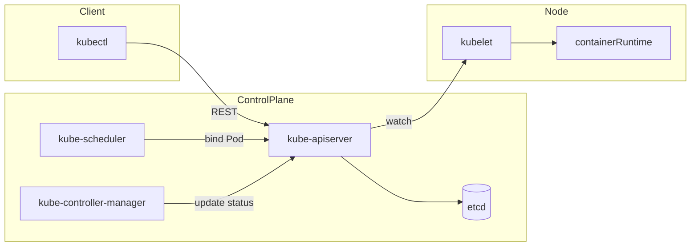

# 01 — Architecture and components

## 1. What Kubernetes is

Kubernetes (K8s) is a **container orchestration** platform: it schedules Pods on Nodes, keeps desired state (controllers), exposes workloads via Services, and stores all configuration in a consistent API backed by **etcd**.

---

## 2. Control plane components

| Component | Role |
|-----------|------|
| **kube-apiserver** | REST API front door; validation, admission; only component that talks to etcd (for data) in typical setups |
| **etcd** | Distributed key-value store; source of truth for cluster state |
| **kube-scheduler** | Assigns unscheduled Pods to Nodes (filter + score) |
| **kube-controller-manager** | Runs controllers (Deployment, ReplicaSet, Node, Job, etc.) — reconcile loop: *desired vs actual* |
| **cloud-controller-manager** | Cloud-specific control loops (e.g., LoadBalancer Service, Node routes) when running on AWS/GCP/Azure |

**Note:** In managed offerings (EKS, GKE, AKS), control plane components are operated by the provider; you still need to understand them for interviews.

---

## 3. Node components

| Component | Role |
|-----------|------|
| **kubelet** | Agent on each node; talks to API server; starts/stops containers via CRI; reports node/pod status |
| **kube-proxy** | Implements Service abstraction (iptables, nftables, or IPVS) — forwards traffic to Pod endpoints |
| **Container runtime** | containerd, CRI-O, etc. — actually runs containers |

---

## 4. Add-ons (common)

- **CoreDNS** — in-cluster DNS (`*.svc.cluster.local`)
- **CNI plugin** — Pod networking (Calico, Cilium, VPC CNI on EKS, etc.)
- **Ingress controller** — implements Ingress / Gateway resources
- **metrics-server** — metrics for `kubectl top` and HPA

---

## 5. High-level request flow



1. You apply a manifest → **kube-apiserver** persists to **etcd**.
2. **Scheduler** sees a Pod with no `nodeName` → assigns a node.
3. **kubelet** on that node pulls spec and starts containers via the runtime.
4. **Controllers** continuously reconcile (e.g., Deployment ensures ReplicaSet count matches).

---

## 6. HA control plane (interview talking points)

- **Multiple API servers** behind a load balancer; **etcd** in odd-member quorum (3, 5) for HA.
- **Leader election** for scheduler and controller-manager (only one active leader per component in classic HA).
- **Version skew:** API server should be **newest**; kubelets can lag one minor; see [Kubernetes version skew policy](https://kubernetes.io/releases/version-skew-policy/).

---

## 7. Namespaces and API objects (mental model)

- **Namespace:** scope for names; not hard multi-tenancy isolation by itself.
- **Kind:** Pod, Service, Deployment, etc. — all are **resources** stored in etcd with `apiVersion`, `kind`, `metadata`, `spec`, `status`.

---

## 8. Example: what happens when you create a Deployment

```bash
kubectl apply -f deploy.yaml
```

1. Deployment controller creates/updates a **ReplicaSet**.
2. ReplicaSet creates **Pods** (Pod template from Deployment).
3. Scheduler binds each Pod to a Node.
4. kubelet creates containers; kube-proxy programs rules so **Service** traffic reaches Pod IPs.

---

## Quick recap

- Control plane: **apiserver + etcd + scheduler + controllers (+ CCM)**.
- Data plane: **kubelet + kube-proxy + runtime + CNI**.
- **etcd** holds desired state; controllers + kubelet converge actual state.

### Interview prompts

1. Walk through what happens from `kubectl apply` to a running Pod.
2. Why is etcd quorum important, and what breaks if you lose quorum?
3. What does kube-proxy do, and how does it relate to Services?
4. How does a managed Kubernetes provider change what you operate vs. what they operate?
